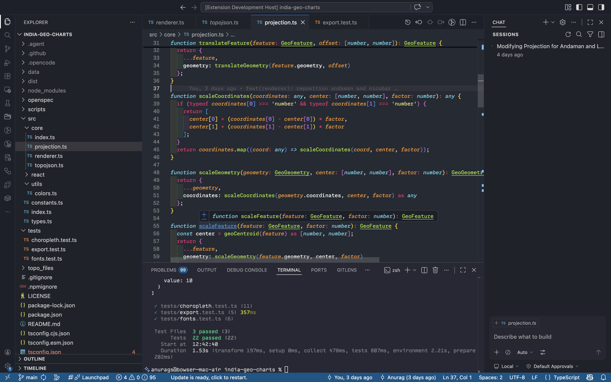
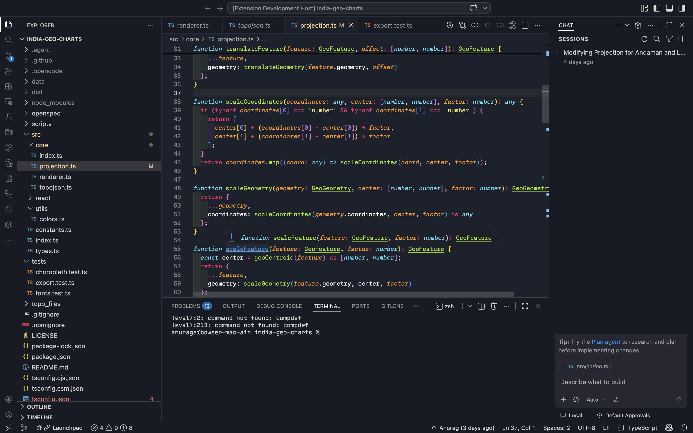
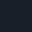
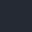
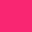
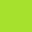
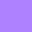

# Abyssal Blue 🪼


[](https://vscode.dev/editor/theme/shenoy-anurag.abyssal-blue)

A Visual Studio Code theme for the those who love the OG Monokai colors for syntax highlighting, and love the deep dark blues of the ocean.

There are two themes in this package:
1. Abyssal Blue.
2. Abyssal Blue Abyss.

Abyss has a slightly darker color palette.

## Abyssal Blue Preview


The main/default theme is `Abyssal Blue`.

Inspired by the colors of the Midnight & Abyssal Zone of the Ocean. Learn about the [Abyssopelagic Zone](https://www.whoi.edu/ocean-learning-hub/ocean-topics/how-the-ocean-works/ocean-zones/), also referred to colloquially as the Abyss.

## Abyssal Blue Abyss Preview
I have created a darker version of the theme, which has the name `Abyssal Blue Abyss`.



# Installation

1.  Install [Visual Studio Code](https://code.visualstudio.com/)
2.  Launch Visual Studio Code
3.  Choose **Extensions** from menu
4.  Search for `abyssal blue`
5.  Click **Install** to install it
6.  Click **Reload** to reload the Code
7.  From the menu bar click: Code > Preferences > Color Theme > **Abyssal Blue**

You can also use the hotkey **Cmd + Shift + P** (on Mac) or **Ctrl + Shift + P** (on Windows) to open the Command Palette, type "theme", and select **Color Theme**, and then pick the **Abyssal Blue** theme.

# Color Palette 
## Abyssal Blue
| Color Name | Color | Primary Application Areas | Hex |
| ------ | ------ | ------ | ------ |
| Dark Denim |  | Status Bar, Highlight for Activity Bar | `#005588` |
| Medium Persian Blue |  | Button Hover | `#0167a4` |
| Halite Blue |  | Suggestion Widget, List Focus | `#062f4a` |
| Cyanophobia |  | PeekView Editor | `#001f33` |
| Washed Black |  | Activity Bar, Title Bar, Menu, Tabs Bar | `#1c202a` |
| Dark Slate |  | Sidebar & Inactive Tab | `#1e222a` |
| Coarse Wool |  | PeekView Title, Empty Editor | `#1a1e28` |
| Sky Captain |  | Dropdown Items, Menu Items | `#252a34` |
| Sky Captain v2 |  | Dropdown Items, Menu Items | `#262732` |

## Monokai Syntax Highlighting Palette
| Color Name | Color | Primary Application Areas | Hex |
| ------ | ------ | ------ | ------ |
| Office Neon Light |  | Keyword, Storage, Tag | `#f92672` |
| Poison Potion |  | Class & Function names | `#a6e22e` |
| Turquoise Sea |  | Storage Type, Library function name | `#66d9ef` |
| Dragon Ball |  | Function arguments | `#fd971f` |
| Purple Illusionist |  | Numbers and Constants | `#ae81ff` |

Color names from https://colornamer.robertcooper.me/

# Preferences shown in the preview

The font in the preview image is Monaspace Neon, [available here](https://monaspace.githubnext.com/). Editor settings to activate font ligatures:

```json
{
    "editor.fontFamily": "Monaspace Neon, Monaco, 'Courier New', monospace",
    "editor.fontLigatures": true,
}
```

I'm using Monaco, Courier New, and monospace fonts as fallbacks, but you can use whatever font you like, or omit them. ☺️

# Misc

This is my first attempt at creating a vs code theme, so if you find an issue or an out-of-place color, please feel free to [file an issue](https://github.com/shenoy-anurag/abyssal-blue-vscode-theme/issues).

If you use [the VS Code Babel extension](https://marketplace.visualstudio.com/items?itemName=mgmcdermott.vscode-language-babel), you may see some inconsistencies in color for JSX, that's not coming from this theme.

If you wish to make your own VS Code extension or theme, check out the [VS Code Extension Documentation](https://code.visualstudio.com/api/get-started/your-first-extension).

This theme is inspired by my favorite theme of all time, [Monokai](https://github.com/microsoft/vscode/blob/f91019e7676ab34ef03e1ccb550a7a6c949fa4cd/extensions/theme-monokai/themes/monokai-color-theme.json), not be confused with the Pro version of the same.