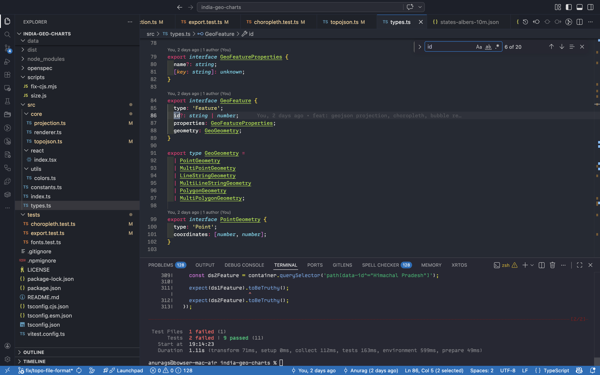

# Abyssal Blue 🪼


[](https://vscode.dev/editor/theme/shenoy-anurag.abyssal-blue)


A Visual Studio Code theme for the those who love the OG Monokai colors for syntax highlighting, and love the deep dark blues of the ocean.

If you wish to make your own VS Code extension or theme, check out the [VS Code Extension Documentation](https://code.visualstudio.com/api/get-started/your-first-extension).

## Abyssal Blue Preview



# Installation

1.  Install [Visual Studio Code](https://code.visualstudio.com/)
2.  Launch Visual Studio Code
3.  Choose **Extensions** from menu
4.  Search for `abyssal blue`
5.  Click **Install** to install it
6.  Click **Reload** to reload the Code
7.  From the menu bar click: Code > Preferences > Color Theme > **Abyssal Blue**


## Preferences shown in the preview

The font in the preview image is Monaspace Neon, [available here](https://monaspace.githubnext.com/). Editor settings to activate font ligatures:

```json
{
    "editor.fontFamily": "Monaspace Neon, Monaco, 'Courier New', monospace",
    "editor.fontLigatures": true,
}
```

I'm using Monaco, Courier New, and monospace fonts as fallbacks, but you can use whatever font you like, or omit them. ☺️

## Misc

This is my first attempt at creating a vs code theme, so if you find an issue or an out-of-place color, please feel free to [file an issue](https://github.com/shenoy-anurag/abyssal-blue-vscode-theme/issues).

If you use [the VS Code Babel extension](https://marketplace.visualstudio.com/items?itemName=mgmcdermott.vscode-language-babel), you may see some inconsistencies in color for JSX, that's not coming from this theme.

This theme is inspired by my favorite theme of all time, [Monokai](https://github.com/microsoft/vscode/blob/f91019e7676ab34ef03e1ccb550a7a6c949fa4cd/extensions/theme-monokai/themes/monokai-color-theme.json).